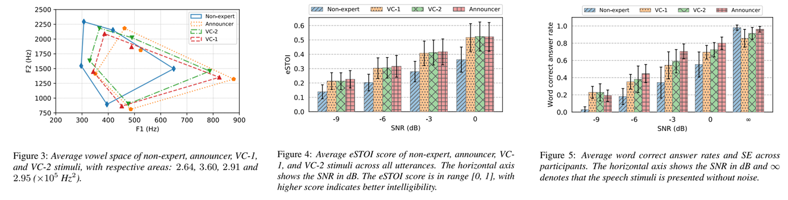
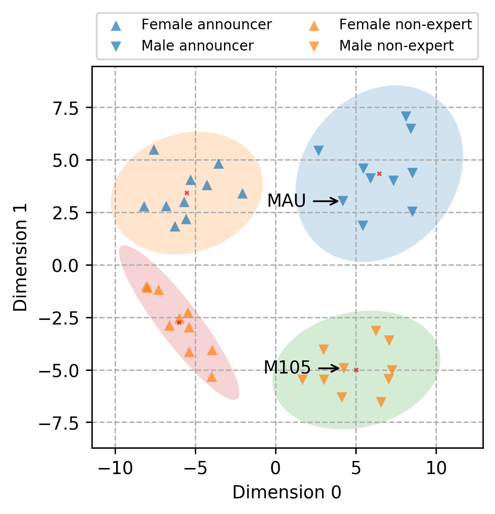
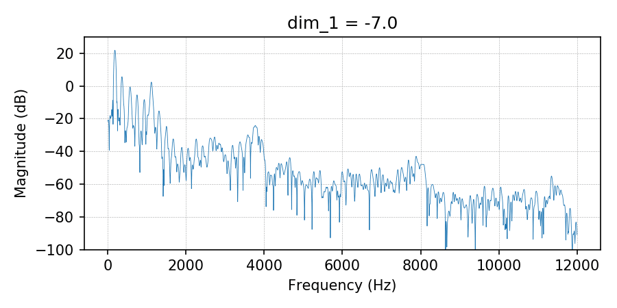

# Intelligible VC: Increase speech intelligibility by mimicking voice of professional announcer using voice conversion 
Official implementation of paper "Speak Like a Professional: Increasing Speech Intelligibility by Mimicking Professional Announcer Voice with Voice Conversion" (accepted in Interspeech 2022)

Author: Ho Tuan Vu, Maori Kobayashi, Masato Akagi

## [Paper]((https://arxiv.org/abs/2206.13021) |  [Demo] (https://tuanvu92.github.io/Intelligible_VC/) | [Installation] (https://github.com/tuanvu92/intelligible_vc#1-installation)

## Abstract
In most of practical scenarios, the announcement system must deliver speech messages in a noisy environment, in which the background noise cannot be cancelled out. The local noise reduces speech intelligibility and increases listening effort of the listener, hence hamper the effectiveness of announcement system. There has been reported that voices of professional announcers are clearer and more comprehensive than that of non-expert speakers in noisy environment. This finding suggests that the speech intelligibility might be related to the speaking style of professional announcer, which can be adapted using voice conversion method. Motivated by this idea, this paper proposes a speech intelligibility enhancement in noisy environment by applying voice conversion method on non-professional voice. We discovered that the professional announcers and non-professional speakers are clusterized into different clusters on the speaker embedding plane. This implies that the speech intelligibility can be controlled as an independent feature of speaker individuality. To examine the advantage of converted voice in noisy environment, we experimented using test words masked in pink noise at different SNR levels. The results of objective and subjective evaluations confirm that the speech intelligibility of converted voice is higher than that of original voice in low SNR conditions.

## Experiment results

Speaker embedding of ATR speakers

Change of spectrogram when interpolating second principal component of speaker embedding

Change of magnitude spectrum when interpolating second principal component of speaker embedding

## 1. Installation
Clone this repo: 
> git clone https://github.com/tuanvu92/Intelligible_VC.git
> cd IntellgibleVC
> pip install -r requirement.txt

To install **intelligible_vc** package using pip:
> pip install https://github.com/tuanvu92/Intelligible_VC.git

## 2. Data
Please get access to AIS-Lab internal server //refresh/share/database/ATR and download A-set and C-set. 

Otherwise, already processed data can be downloaded here: 
https://jstorage-2018.jaist.ac.jp/s/XLJi6jSo6e55BtJ

Please send email to tuanvu@jaist.ac.jp for password.

Extract the zip file and place all files under **data/** folder.

## 3. Preprocess data
(Skip this step if you used already preprocessed data)

Data should be split and combine into roughly 5-second segments. To run preprocessing, modify the __CORPUS_PATH__ and __OUTPATH__ in preprocess_data.py file and run 

> python preprocess_data.py

## 4. Run training
For single-GPU training:
> python train.py -p config/config.yml

For multi-GPU training
> python distributed.py -f train.py

Pretrained model can be downloaded here: 
https://jstorage-2018.jaist.ac.jp/s/EcD4y2eWTjxFX2J

Password: aislab2022

## 5. Demo notebooks
Install Jupyter notebook: https://jupyter.org/install

Start Jupyter notebook server:
> cd IntelligibleVC
> 
> jupyter notebook

Start browser and navigate to: http://localhost:9999/

There are several notebooks in **notebooks/** folder.
- demo.ipynb: test inference
- interactive_demo.ipynb: interpolate speaker embedding using sliders and generate converted audio
- mix_noisy_data.ipynb: mix data with noise for listening test
- visualize_speaker_embedding.ipynb: plot speaker embedding from trained model

